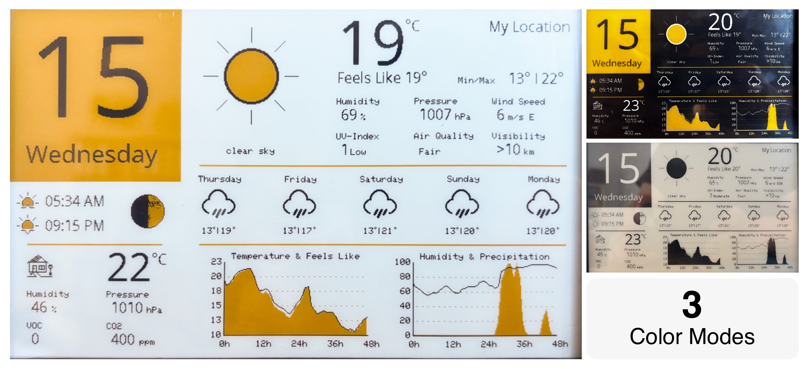
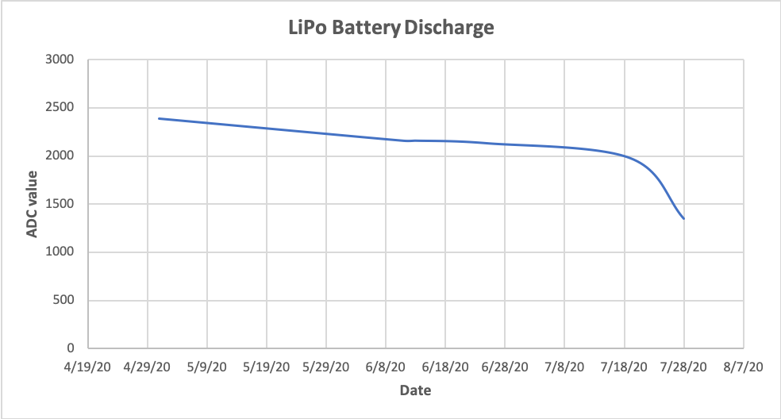

# ESP32 - Weather Display

> 7.5 in three color eInk Display, showing the current weather and five day forecast from OpenWeatherMap as well as indoor sensor measurements using an ESP32



## Color Modes

Now the UI provides 3 color modes, a `light mode` with a white background, a `dark mode` with a black background and a `black and white` mode with only two colors.

The weather data is received from [OpenWeatherMap](https://openweathermap.org/) API. You can get a developer account with 1000 API calls/day for free. The display is updated about every 30 min and is performing three API calls, one to receive the current weather data and a five day forcast, one for the 48h hourly forcast and one to receive the current air quality.

The previous version used **DarkSky** which got aquired by Apple ([Apple Inc. has acquired Dark Sky](https://blog.darksky.net/dark-sky-has-a-new-home/)) and is no longer available.

Previously, the [Arduino IDE](https://arduino.cc) had been used, but with the change to OpenWeatherMap, also the software package for development has been switched to [Platform IO](https://platformio.org/).

## Settings (configuration.h)

When installing the library, rename the file `configuration.h.template` in the `/include/` folder to `configuration.h` and enter your settings.

| Option                     | Default    | Description                                                                                   |
| :------------------------- | :--------- | :-------------------------------------------------------------------------------------------- |
| `WIFI_SSID`                |            | WiFi SSID                                                                                     |
| `WIFI_PASSWORD`            |            | WiFi password                                                                                 |
| `OWM_API_KEY`              |            | The OpenWeather developer key for 1000 request/day (https://openweathermap.org)               |
| `LOCATION_LONGITUDE`       |            | Longitude, between −180 and 180                                                               |
| `LOCATION_LATITUDE`        |            | Latitude, between −90 and 90                                                                  |
| `LOCATION_ELEVATION`       |            | Elevation in meters (e.g. ) (https://www.mapdevelopers.com/elevation_calculator.php)          |
| `LOCATION_NAME`            |            | Name of the location (leave empty if no label needed)                                         |
| `I18N_UNITS`               | `"metric"` | Unit format `standard`, `metric`, `imperial` (https://openweathermap.org/api/one-call-3#data) |
| `I18N_LANGUAGE`            | `"en"`     | language (https://openweathermap.org/api/one-call-3#multi) _Not fully implemented_            |
| `DISPLAY_SLEEP_DURATION`   | `30`       | Interval of display updates in minutes. More frequent updates increase battery usage          |
| `DISPLAY_POWER_SAVE_START` | `22`       | Start of power save mode (22 = 10pm)                                                          |
| `DISPLAY_POWER_SAVE_END`   | `5`        | End of power save mode (5 = 5am)                                                              |
| `DISPLAY_COLOR_MODE`       | `"light"`  | Select one of the following modes: `light`, `dark`, `bw` (black and white)                    |

## I18n (Internationalization)

OpenWeatherMap is supporting severeal different languages. For a full list refer to the [API documentation](https://openweathermap.org/api/one-call-3#multi). The UI is not supporting all of them and the fall back language is English, with only the current weather wording provided by the OpenWeather in the selected language. As of now only **German (de)** and **Dutch (nl)** are also available for the UI.

Several languages are not supporting the full set of ASCII characters, meaning language specific special characters might not be displayed correctly at this point.

## Wiring Components


| ESP32  | PIN  | Function             |
| :----: | :--: | :------------------- |
|  SCK   | IO21 | Clock                |
|  SDA   | IO22 | Data                 |
|  GND   | GND  | Ground               |
|  VIN   |  5V  | 5 Volt               |
|  3.3V  | 3.3V | 3.3 Volt             |
| GPIO04 | IO4  | Digital Pin high/low |
| GPIO34 | IO34 | Analog Pin 0-4095    |

Thanks to [Robert Zegarac](https://github.com/zegarac) for his help designing the circuit to measure the battery charge and powering down the sensors as well as soldering the SMD parts.

## Hardware Components

- **Picture Frame**
  - Make sure to have enough room in the back for the electronics
- **Controller (Driver)**
  - [E-Paper ESP32 Driver Board](https://www.waveshare.com/wiki/E-Paper_ESP32_Driver_Board)
- **Display**
  - [7.5inch e-Paper HAT (C)](<https://www.waveshare.com/wiki/7.5inch_e-Paper_HAT_(C)>) - **V1, resolution 640x384**
- **Sensors**
  - Sparkfun [HTU21D - Humidity/Temperature](https://github.com/sparkfun/SparkFun_HTU21D_Breakout_Arduino_Library) - _discontinued_
  - ~~Sparkfun [BME180 - Pressure/Temperature](https://github.com/sparkfun/BMP180_Breakout) - _discontinued_~~
  - Adafruit [BMP280 - Pressure/Temperature](https://github.com/adafruit/Adafruit_BMP280_Library) - replacement for BME180 since it supports 5V input
  - Adafruit [CSS811 - MOC/eCO2](https://github.com/adafruit/Adafruit_CCS811)
- **Power**
  - [Micro LiPo Charger](https://www.adafruit.com/product/1904)
- LiPO battery - can be one off the shelf or in my case I used an old laptop cell (3.7v @ 16.07Wh).

### Modifying the Controller

The power regulator on the controller board is not the best when using the board with battery, dropping out too early not making use of the batteries full capacity. It has been replaced with a [AP7361C-33ER-13](https://www.digikey.com/product-detail/en/diodes-incorporated/AP7361C-33ER-13/AP7361C-33ER-13DICT-ND/8545922) from Digi-Key, which has a lower dropout voltage (0.36V @ 1A).

## Software and Dependencies

- **Display Driver and GFX**
  - [Display Driver (Jean-Marc Zingg)](https://github.com/ZinggJM/GxEPD2)
- **Fonts**
  - [OpenSans](https://www.opensans.com) - Standard open font
  - [GNU FreeFont](https://www.gnu.org/software/freefont/) - included in Adafruit's GFX library
- **Other**
  - [ArduinoJson](https://arduinojson.org) - Powerful JSON parser for Arduino
  - [WiFi](https://www.arduino.cc/en/Reference/WiFi) - Arduino IDE
  - [HTTPClient](https://www.arduino.cc/en/Tutorial/HttpClient) - Arduino IDE
  - [WiFiClientSecure](https://github.com/espressif/arduino-esp32/tree/master/libraries/WiFiClientSecure) - Arduino IDE
  - [math](https://www.arduino.cc/en/Math/H) - Arduino IDE

## Inspiration for Code and Design

- [David Bird (G6EJD)](https://github.com/G6EJD/ESP32-e-Paper-Weather-Display) - Fantastic display for weather data from [Open Weather Map](https://openweathermap.org)
- [Weather Icons (Erik Flowers)](https://erikflowers.github.io/weather-icons) - Beautiful icon font for weather icons

## Fonts

The project uses the popular open source font [Open Sans](https://fonts.google.com/specimen/Open+Sans) for all larger fonts. To reduce the amount of memory used, the character set has been reduced to the ones required.

For small fonts like the ones used for units and in the graph the standard fonts packaged with the Adafruit GFX library were used.

### Local

To create the custom font files the `fontconvert` script packaged with the [Adafruit GFX](https://github.com/adafruit/Adafruit-GFX-Library) library was used.

The font files can be generated in the following way, where `size` is the desired font size, and `first character` and `last character` are the positions within the ascii table.

```bash
fontconvert <font.ttf> <size> <first character> <last character> > <out.h>
```

A nice video on how to create these files by Kris Kasprzak can be found [here](https://www.youtube.com/watch?v=L8MmTISmwZ8).

### Online

A more convenient option is using online tools to generate the bitmap fonts. The selected TrueType font can be converted using the [truetype2gfx](https://rop.nl/truetype2gfx/) tool.

The second tool can be used to select a subset of characters if needed or the characters can be edited using the [Adafruit GFX Pixel font customiser](https://oprekersmania.github.io/Adafruit-GFX-Font-Customiser/) tool.

## Graphics

### Icons

All icons depicting the current weather and forecast are created after the beautiful set of icons by [Erik Flowers (Weather Icons)](https://erikflowers.github.io/weather-icons). They are not bitmaps but all drawn using the shapes provided by the GFX library, allowing them to be scaled depending on where they are used and ultimately saving memory.

### The Moon

The moon displayed to represent the current moon phase is not a bitmap. The shadow is drawn depending on the value provided by the weather API ranging between `0` - `1`. The surface was generated taking a picture of a full moon and turning it into a true black and white image (dithering). After resizing it to match the size on the display a short JavaScript script was used to determine all black pixels and output the code required by the GFX library to draw the surface. The moon cannot be scaled, when including the surface, but on the other hand no bitmap is required.

### House (indoor)

The second version of the house depicting indoor values collected is more detailed. The window and streetlight are yellow or have a yellow cone, depicting light at night. When the display is in "night mode" and only updating every 2 hours, the "lights" are on to indicate the energy saving mode.

### Graphs

The two graphs have each two plots a black line plot and a yellow filled area plot. The temperature graph shows the predicted temperature (black line) and apparent temperature (yellow area) for the next 48 hours. The other one shows the relative humidity (black line) and rain probability (yellow area) forecast for the same timeframe.

## Sensors

The sensors in the frame collect data to display the indoor climate. The frame is now hanging on the wall with a little gap and the values are comparable to the thermostat in the house, indicating that there is enough air flow to acquire reasonable measurements. The CCS811 is a difficult sensor, since it needs time to heat up for a correct measurement of volatile compounds (VOC) and eCO₂. The sensor is run for 30s before the display is updated. Most of the time it is showing 400 ppm for eCO₂ and 0-20 for VOC. Due to power saving the sensor can't be run for longer, for stable reads, but also the lack of an available calibration, makes the sensor more of a guesstimate than an actual measurement at this point.

## Assembling the Frame (1st Version)


1. Rectangular hole cut at the bottom of the frame for the display for the displays FPC cable.
2. Double sided sticky tape added to the corners of the display's backside.
3. The display glued into the center of the picture frame.
4. Inside, the FPC adapter is glued to the back with hot-glue.
5. Insert all the components into the back of the frame. Female connectors are glued into the frame, so the two boards (sensors & controller) can be easily attached with male pin connectors and be removed at any time. The battery is attached with velcro tape.
6. Cover the display with the plexiglas. To cover up the gap between the display and the frame, a vinyl frame was laser-cut from a vinyl sheet with a sticky back and glued onto the plexiglas.

## Battery Life

The first version of the code would update the display every 30 minutes and together with the CCS811 not being able to properly powering down, it would last for about a week.

The new version updates the display every 30 minutes during the day and only every 2 hours at night. Also the hardware has been updated, allowing to turn off the power for the sensors completely, resulting in a battery life of about **3 months** now (see battery discharge graph). The _battery low_ icon will now be displayed when the ADC value to monitor the battery charge drops below 2000.



## Previous Versions

As **DarkSky** is no longer available, find the latest version in the [darksky](https://github.com/SeBassTian23/ESP32-WeatherDisplay/tree/darksky) branch.


_Updated Layout:_ Larger font for temperature and units. New icon for in-house values and rearranged values for current weather.


_Old Layout:_ Initial layout.
